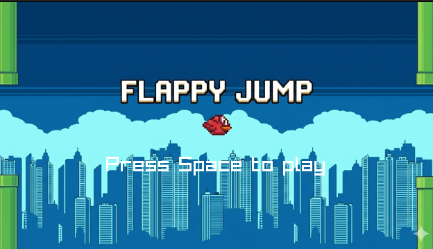
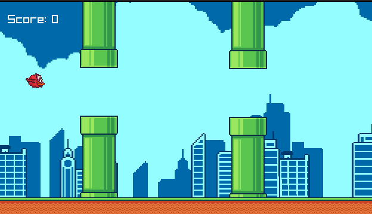
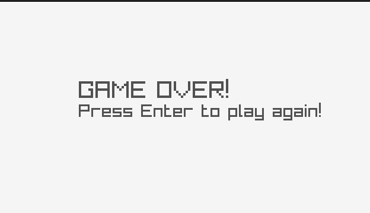

# Flappy Bird — Built in C with Raylib

> A fully functional Flappy Bird clone written from scratch in **pure C**, built without a game engine.  
> Every system — physics, animation, collision, audio, state management — is implemented manually at the code level.

<br>

## Demo

### Gameplay
<video src="images/flappy_video.mp4" controls width="100%"></video>

<br>

### Screenshots

| Menu | Gameplay | Game Over |
|------|----------|-----------|
|  |  |  |

<br>

---

## Overview

I built this project to understand how a real-time interactive application works at a systems level — not by reaching for engine abstractions, but by implementing each subsystem by hand.

Raylib is used strictly as a **platform layer**: it opens a window, gives access to input, exposes GPU draw calls, and streams audio. Everything built on top of it — the physics, animation, collision, game state, scrolling, and sound — is custom C code.

**Stats:**
- ~750 lines of C across **9 source files**
- 5 header files defining clean module interfaces
- Managed with a custom **Makefile**
- Tracked across **17 Git commits**

<br>

---

## Project Structure

```
.
├── src/
│   ├── main.c        # Entry point, game loop, state dispatch
│   ├── init.c        # Asset loading and struct initialization
│   ├── state.c       # Game state update and draw logic
│   ├── movement.c    # Physics, animation, collision detection
│   ├── render.c      # All draw calls and GPU texture management
│   └── sound.c       # SFX and music stream management
├── include/
│   ├── init.h        # Struct definitions (Bird, Tube, Background, etc.)
│   ├── state.h       # State enum + function declarations
│   ├── movement.h
│   ├── render.h
│   └── sound.h
├── asset/            # Textures and sprite sheets
├── sound/            # WAV and MP3 audio files
├── images/           # Screenshots and demo video
├── Makefile
└── README.md
```

<br>

---

## Technical Implementation

### State Machine

The game is structured around an explicit finite state machine. A `State` enum drives both the update and render loops:

```c
typedef enum {
    MENU = 0, GAME, PAUSE, OVER
} State;
```

Each frame, a `switch` on `currentState` dispatches to the correct update and draw logic. Transitions between states (e.g. MENU → GAME on spacebar, GAME → OVER on death) are handled explicitly with no global flags. This keeps the game loop clean and each state fully self-contained.

<br>

### Physics System

The bird runs on a simple but accurate physics model using **delta time** (`dt`) so behaviour is framerate-independent:

```c
bird->velocity.y += bird->acceleration * dt;  // gravity accumulates
bird->hitbox.y   += bird->velocity.y * dt;    // position integrated from velocity
```

On jump, velocity is set to a negative value (upward impulse):

```c
if (IsKeyPressed(KEY_SPACE) && bird->canJump)
    bird->velocity.y = -bird->jumpSpeed;
```

Rotation is derived directly from velocity — no animation curves, just a ratio clamped to ±45°:

```c
rotation = ClampObject(velocity.y / angleSpeed, -45.0f, 45.0f);
```

<br>

### Sprite & Animation System

The bird is drawn from a **4-frame sprite sheet**. Animation is managed manually using a frame counter and a timer derived from the current FPS:

```c
float timer = GetFPS() / (anim->totalFrame + animSpeed);
if (anim->frameCounter >= timer) {
    anim->currentFrame = (anim->currentFrame + 1) % anim->totalFrame;
}
source->x = anim->currentFrame * source->width;
```

The draw call uses `DrawTexturePro` for precise source/destination rectangle control, which also enables the rotation pivot to be set independently from the sprite's screen position.

<br>

### Collision Detection

Collision uses **AABB (Axis-Aligned Bounding Box)** testing via Raylib's `CheckCollisionRecs`. Each tube carries a separate top and bottom hitbox, and the bird has its own hitbox offset slightly inward from the visible sprite — making collision feel fair rather than pixel-perfect:

```c
// Hitbox is inset from the visible sprite edges
p.hitbox = (Rectangle) {
    50 + offsetWidth, GetScreenHeight()/2 - scaleHeight/2,
    scaleWidth - offsetWidth * 2, scaleHeight - offsetHeight
};
```

When a collision is detected, `canJump` is set to `false`, which locks input and lets gravity pull the bird off screen — triggering the OVER state naturally.

<br>

### Infinite Scrolling Background

The background uses a **dual-texture scroll** technique. Two copies of the background texture are drawn side-by-side. A `scrollBack` offset decrements each frame:

```c
bg->scrollBack -= speed * dt;
if (bg->scrollBack <= -(bg->texture.width * bg->scale))
    bg->scrollBack = 0.0f;  // reset seamlessly
```

The second texture is placed immediately after the first in world space, so when the first scrolls out of view, the second takes its place — creating seamless infinite parallax at zero memory cost.

<br>

### Tube Design Decision

The tube sprite was designed so that **the gap between the top and bottom pipe is baked into the PNG itself**. This means the game code never has to calculate or manage gap positioning — placing a single texture automatically places both pipes and their gap at the correct relative positions. The hitboxes are then computed as offsets from the texture's top and bottom halves.

<br>

### Sound System

Audio is split into two separate subsystems:

- **SFX** (`Sound`) — one-shot sounds for jump, score, and death, loaded into memory and played with `PlaySound`
- **Music** (`MusicStream`) — streamed MP3 tracks for menu and gameplay, managed with `UpdateMusicStream` each frame

Both are stored in dedicated structs (`Sfx`, `BgMusic`) and cleanly initialized and unloaded through their own functions. Music transitions on state change:

```c
StopMusicStream(music.menuMusic);
PlayMusicStream(music.gameMusic);
```

<br>

### Memory Management

Every texture, sound, and music stream is explicitly loaded and unloaded. There is no garbage collection. On exit, each asset is freed:

```c
UnloadTexture(bird.spriteSheet);
UnloadTexture(bg.texture);
UnloadTubeAll(&tubes, NO_OF_TUBES);
UnloadSfx(assetSfx);
UnloadMusic(music);
CloseWindow();
```

<br>

**Controls:**

| Key | Action |
|-----|--------|
| `Space` | Flap / Start game |
| `Enter` | Restart after game over |

<br>

---

## Built With

- **Language:** C (C99)
- **Library:** [Raylib 5.x](https://www.raylib.com/) — windowing, rendering, input, audio
- **Build:** GNU Make
- **Version Control:** Git

<br>

---

## Why C?

C has helped me learn many low level concepts which higher level languages hide. Without the help of engine while also enjoying making something i chose to use C + raylib to make a game. After lots of trial and error, I was able to take the steps to create a modular raylib project. This project was built in C specifically to have full visibility into and responsibility for every part of the system.
